University: [ITMO University](https://itmo.ru/ru/)  
Faculty: [FICT](https://fict.itmo.ru)  
Course: [Introduction to distributed technologies](https://github.com/itmo-ict-faculty/introduction-to-distributed-technologies)  
Year: 2023/2024  
Group: K4113c  
Author: Smirnov Georgy 
Lab: Lab3  
Date of create: 21.12.2023  
Date of finished: 21.12.2023
---
# Сертификаты и "секреты" в Minikube, безопасное хранение данных
## Цель работы
Познакомиться с сертификатами и "секретами" в Minikube, правилами безопасного хранения данных в Minikube.
## Ход работы
### 1. Cоздание configMap с переменными: REACT_APP_USERNAME, REACT_APP_COMPANY_NAME
Переменные REACT_APP_USERNAME, REACT_APP_COMPANY_NAME передаются в Deployment

Создаем `ConfigMap` с переменными `REACT_APP_USERNAME` и `REACT_APP_COMPANY_NAME`
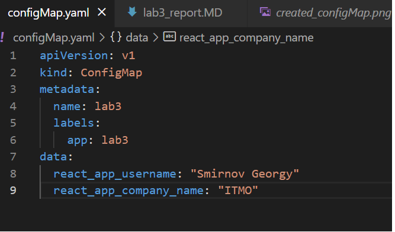

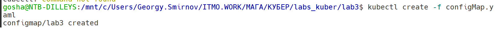

### 2. Создание ReplicaSet с 2 репликами контейнера и Service
Прописываем `envForm`, чтобы переменные были взяты из `ConfigMap`.

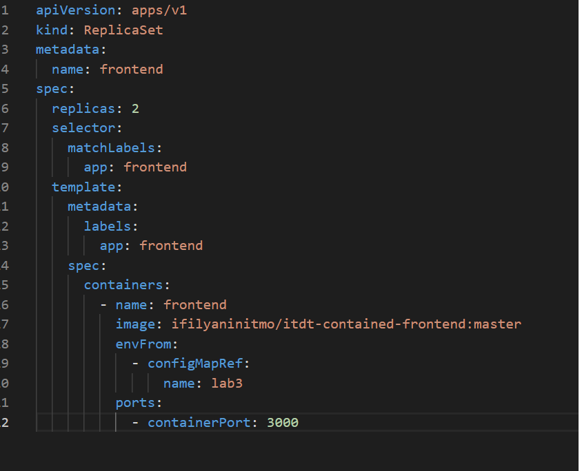

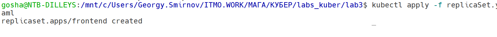

Создаем Service

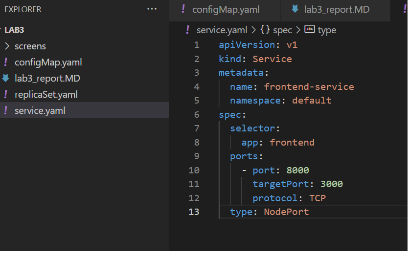


### 3. Генерация TLS сертификата
Сгенерируем TLS сертификат


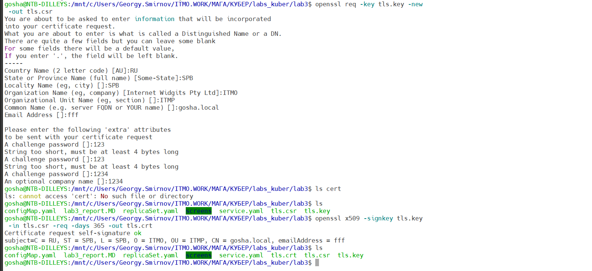


Далее создаем секрет, добавляя сертификат в `minikube` с помощью команды:
```
kubectl create secret tls tls-secret -o yaml --key=tls.key --cert=tls.crt > secret.yaml
```

### 4. Создание Ingress
Чтобы подключить `ingress`, необходимо выполнить команду:
```
minikube addons enable ingress
```

Далее необходимо написать манифест для `ingress`

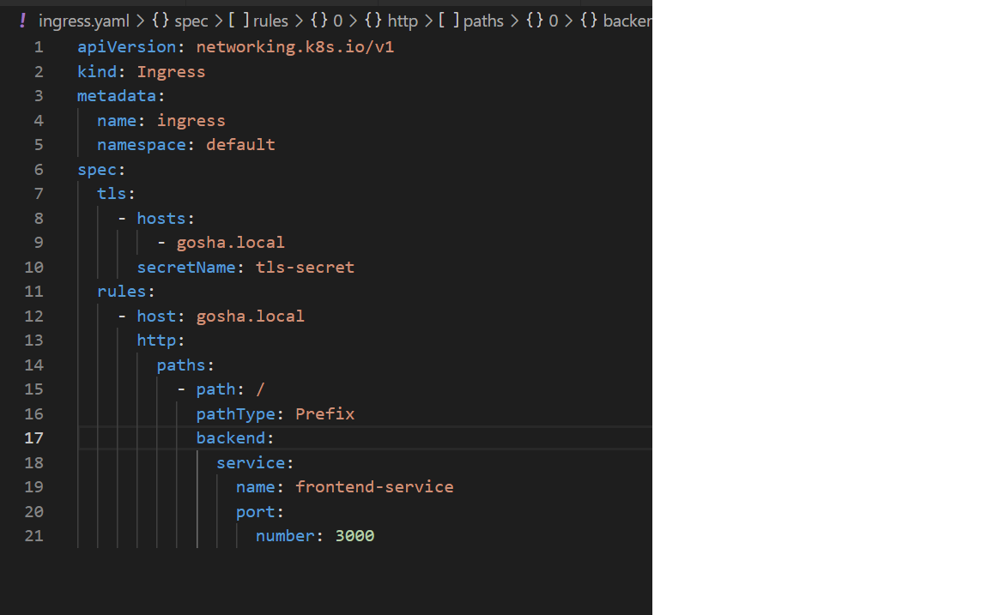

### 5. Создание Secret

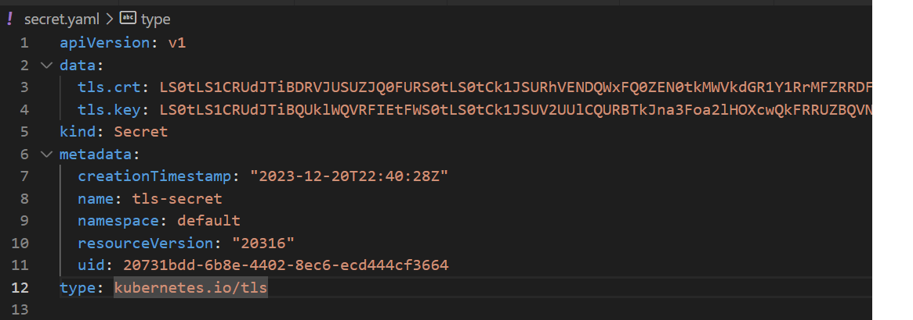

### 6. Перейдем в браузер
Для начала необходимо добавить запись в файл `hosts`, чтобы связать ip-адрес и доменное имя:

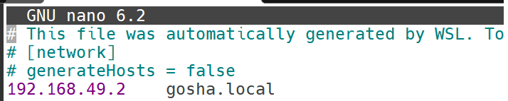

Подключаемся к Ingress командой с помощью команды:
```
minikube tunnel
```
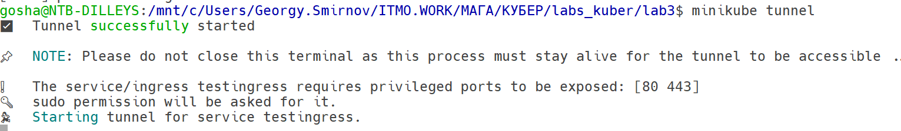

Открываем страницу с адресом  `https://gosha.local/`

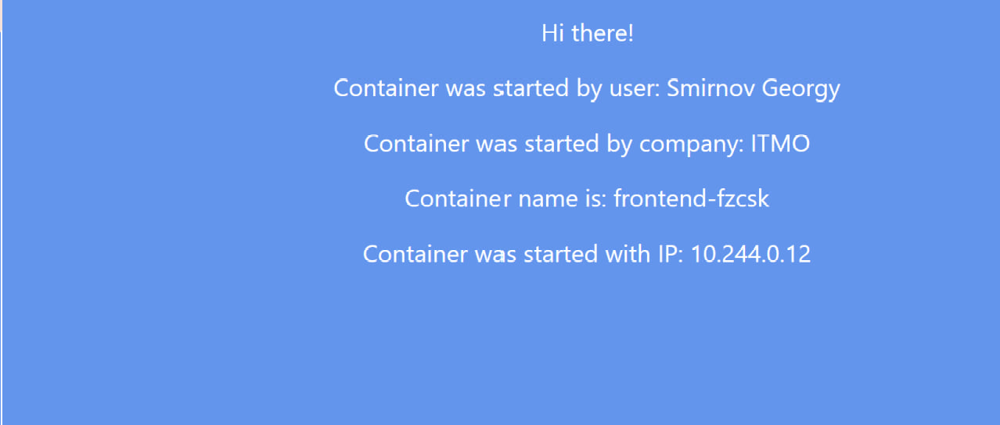

## Схема

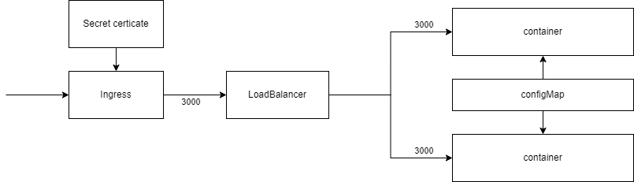