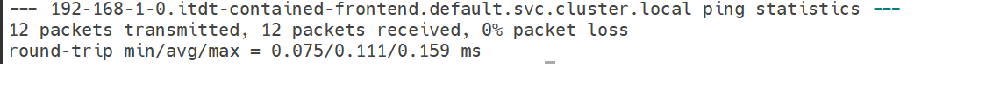

University: [ITMO University](https://itmo.ru/ru/)
Faculty: [FICT](https://fict.itmo.ru)
Course: [Introduction to distributed technologies](https://github.com/itmo-ict-faculty/introduction-to-distributed-technologies)
Year: 2023/2024
Group: K4113c
Author: Smirnov Georgy Aleksandrovich
Lab: Lab3
Date of create: 21.12.2023
Date of finished: 21.12.2023

## Лабораторная работа №4 "Сети связи в Minikube, CNI и CoreDNS"

### Описание
Это последняя лабораторная работа в которой мы познакомимся с сетями связи в Minikube. Особенность Kubernetes заключается в том, что у него одновременно работают underlay и overlay сети, а управление может быть организованно различными CNI.

### Цель работы
Познакомиться с CNI Calico и функцией IPAM Plugin, изучить особенности работы CNI и CoreDNS.

### Ход работы
- Запускаем minikube с устанволенным плагином Calico и двумя нодами.

- Присвоим запущенным нодам метки варианты

- Создаем файл манифеста для назначения пула IP узлам на основе их меток

- Удаляем дефолтный Ippools и создаем свои

- Создаем манифест из 2 лр и запускаем на 8000 порту приложение

- Переменные container name и container ip изменяются в зависисмости от пода в который попал запрос
 

- Чтобы убедиться в этом удалим под в который попали и запустим снова

 

Можно заметить что эти значения изменились

получаем айпи каждого пода

Заходим на под, имеющий ip адрес 192.168.0.65 и имя itdt-contained-frontend-b5496ff45-z8d6v, узнаем fqdn второго пода и производим команду ping

# Схема

